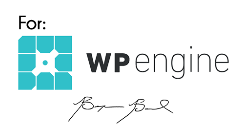

# WPE Featured Post
This plugin was developed for WP Engine to allow author to determine what theme is currently being used on each page. You can also filter page by specific theme templates. All of this is done directly within native WordPress page editor in WP Admin 
> /edit.php?post_type=page
